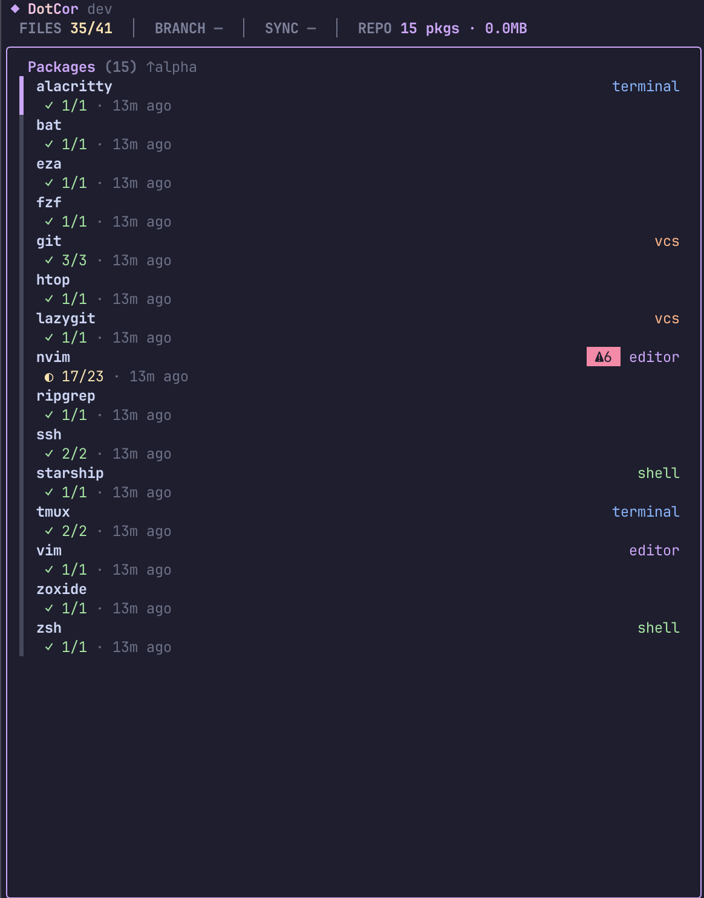
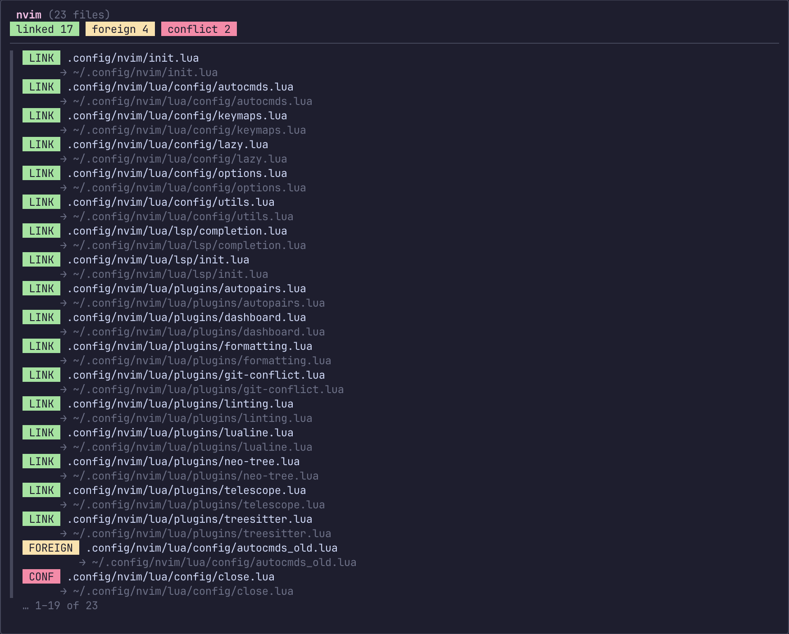
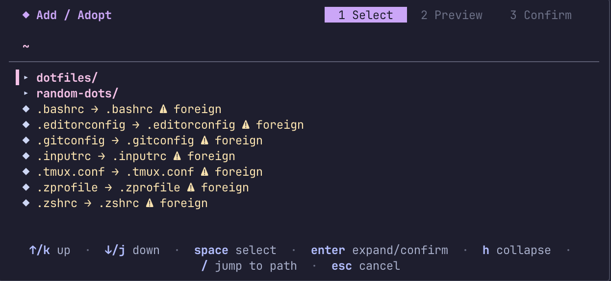

# dotcor


<p align="center">
  
</p>

A symlink-based dotfile manager with TUI and automatic Git commits.

dotcor provides a lazygit-style terminal dashboard for managing your dotfiles with GNU Stow-style packages. Edit your dotfiles directly — changes instantly appear in your repository with automatic Git commits.

---

## Installation

**Homebrew:**
```bash
brew tap justincordova/dotcor
brew install dotcor
```

---

## Quick Start

```bash
dotcor
```

That's it. On first run, dotcor asks to create `~/.dotcor/` and launches the TUI dashboard.

---

## First Run

```
$ dotcor
Not initialized. Create ~/.dotcor? (y/N): y
Created ~/.dotcor
```

A simple `y/N` prompt, then the TUI launches. If a v1.x layout is detected, a one-time migration is offered.

---

## Screenshots

*Dashboard: package list*



*Dashboard: package files (expanded)*



*Add wizard: browse and select dotfiles*



---

## How It Works

dotcor uses **Stow-style packages** — each dotfile group is a directory in `~/.dotcor/` that mirrors `$HOME`:

```
~/.zshrc (symlink) ──> ~/.dotcor/zsh/.zshrc (actual file)
                                │
                          Git repository
```

- **Individual file symlinks** — never directory symlinks
- **Relative paths** — portable across machines
- **Automatic Git commits** after every stow/unstow/sync operation
- **Filesystem-only state** — no managed_files list; everything is discovered from disk

---

## Directory Layout

```
~/.dotcor/
├── .git/
├── .dotcorrc                  # config (YAML)
├── logs/
│   └── dotcor.log
├── backups/
│   └── 2026-01-15_10-30-00/
│       └── .zshrc
├── zsh/                       # package
│   └── .zshrc
├── nvim/                      # package
│   └── .config/nvim/
│       ├── init.lua
│       └── lua/
├── git/                       # package
│   └── .gitconfig
└── tmux/                      # package
    ├── .tmux.conf
    └── .tmux.theme.conf
```

Each top-level directory is a **package**. Excluded: `.git`, `logs`, `backups`, `.stow-local-ignore`, `.dotcorrc`.

---

## TUI Dashboard

```
┌─────────────────────────────────────────────────────────────────────────────┐
│  dotcor v2.0.0                                                     1 package │
├──────────────────────────────────────┬──────────────────────────────────────┤
│  Packages (5)                   [1]  │  zsh                                    │
│ ┌──────────────────────────────────┐ │ ┌────────────────────────────────────┐ │
│ │▶ zsh                        ✓   │ │ │ .zshrc  → ~/.zshrc          linked │ │
│ │  nvim                       ✓   │ │ │                                    │ │
│ │  git                        ⚠   │ │ │                                    │ │
│ │  tmux                       ✓   │ │ │                                    │ │
│ │  starship                   ✗   │ │ │                                    │ │
│ └──────────────────────────────────┘ │ └────────────────────────────────────┘ │
├──────────────────────────────────────┴──────────────────────────────────────┤
│  ● 1 uncommitted change  ↑2 ahead  git/main                                │
├─────────────────────────────────────────────────────────────────────────────┤
│  ?_help  a_dd  d_remove  s_tow  u_nstow  S_sync  /_search  q_quit         │
└─────────────────────────────────────────────────────────────────────────────┘
```

### Keybindings

| Key | Action |
|-----|--------|
| `↑/↓` or `j/k` | Navigate |
| `Enter` | Expand / select |
| `s` | Stow (link) selected package |
| `u` | Unstow (unlink) selected package |
| `A` | Stow all packages |
| `a` | Add file (opens add flow) |
| `d` | Remove / unlink selected file |
| `x` | Delete package |
| `i` | Initialize git in repo |
| `S` | Sync (git commit + push) |
| `p` | Push |
| `P` | Pull |
| `D` | View diff for selected |
| `H` | View history for selected |
| `L` | Toggle log viewer |
| `,` | Settings |
| `/` | Search packages and files |
| `?` | Full keybinding help |
| `q` | Quit |

### Screens

| Screen | Key | Description |
|--------|-----|-------------|
| Dashboard | default | Package list + file details |
| Add Flow | `a` | Path input, package detection, secret scan |
| Diff View | `D` | Scrollable diff with syntax highlighting |
| History | `H` | Git log for selected file, restore from any commit |
| Logs | `L` | File log viewer with level filtering |
| Help | `?` | Full keybinding reference |
| Settings | — | Git remote, ignore patterns, backup management |

---

## Configuration

Config stored in `~/.dotcor/.dotcorrc`:

```yaml
git_remote: ""
ignore_patterns:
  - "*.key"
  - "*.pem"
  - ".env"
  - ".env.*"
  - "id_rsa"
  - "id_ed25519"
  - "*_history"
  - "*.log"
  - "*.swp"
  - "*.swo"
  - ".DS_Store"
```

Patterns follow `.gitignore` conventions:

| Pattern | Matches |
|---|---|
| `.env` | any file named `.env`, at any depth |
| `node_modules` | that directory and everything under it, at any depth |
| `.ssh/*` | files directly inside any `.ssh` directory |
| `secrets/**` | everything under any `secrets` directory |
| `**/*.log` | any `.log` file at any depth |

Omitting `ignore_patterns` entirely keeps the defaults above. Only an explicit
empty list (`ignore_patterns: []`) turns filtering off.

`git_remote` is stored without credentials. `.dotcorrc` lives inside the repo
and is committed, so a token embedded in the URL would be pushed to the remote;
the real URL is kept in `.git/config`, which is never committed. Use a git
credential helper rather than putting a token in the URL.

No `managed_files` list. No `version` field. State is discovered from the filesystem.

---

## CLI Flags

Minimal — processed before TUI launch:

| Flag | Action |
|------|--------|
| `--version` | Print version and exit |
| `--debug` | Set log level to debug |
| `--log-level <level>` | Set log level: debug, info, warn, error |

---

## Requirements

- macOS (Intel or Apple Silicon)
- Git

---

## Comparison

| Feature | dotcor | GNU Stow | Chezmoi | yadm |
|---------|--------|----------|---------|------|
| Approach | Symlinks + auto Git | Symlinks only | Templates + copy | Entire home as repo |
| TUI | Yes (Bubble Tea) | No | No | No |
| Auto commits | Yes | No | No | Manual |
| Packages | Stow-style dirs | Stow-style dirs | Single source state | N/A |
| Edit directly | Yes | Yes | No (via apply) | Yes |
| Secret scanning | Yes | No | Yes (templates) | No |

---

## License

MIT
